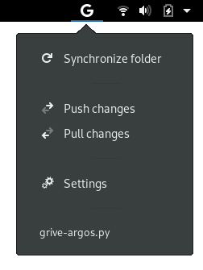
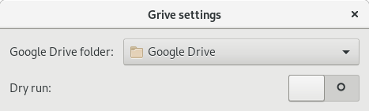

# grive-argos

Integrates basic [Grive2](https://github.com/vitalif/grive2) functionality into Gnome Shell as an extension.

## Installation

Copy the content of `icons` to your `~/.local/share/icons`. The folder `grive_argos` and the python script `grive-argos.py` is supposed to be copied to `~/.config/argos`. Also make sure to make `grive-argos.py` executable such that Argos can pick it up.

## Usage

In the drop-down menu you will find the three functionalities synchronize, push and pull.

* synchronize runs the command `grive -P` in your local Google Drive folder.
* pull runs the command `grive -P -f` in your local Google Drive folder.
* push runs the command `grive -P -u` in your local Google Drive folder.

Depending on whether you set the option dry-run, in each of the commands, the argument `--dry-run` is passed.
See the grive documentation for more information

To set your Google drive folder and whether or not to perform a dry-run, you can open the settings dialog via the
Settings entry in the drop down menu.

